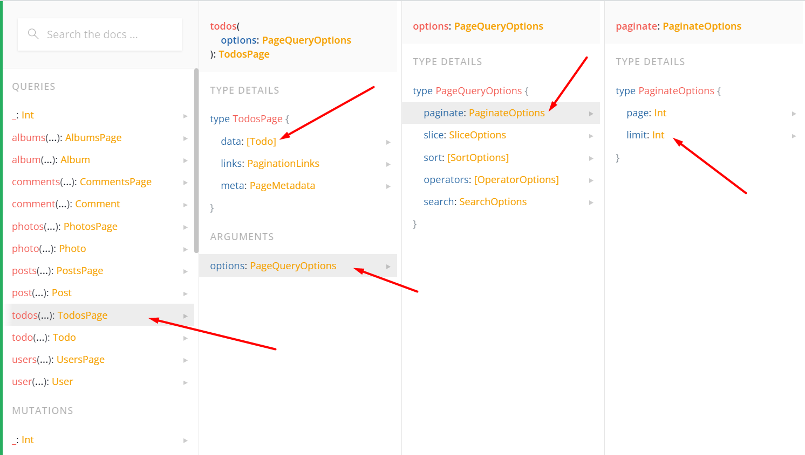

### You are implementing a sample TODO's app. Your "fetch" SDK is not released yet, so it's accessible only locally.

## Option 1 (GraphQL):

1. Under ./graphql-fetch folder initialize a typescript based sdk, initialize npm library:
    * Implement a function called `nativeFetch` - executes graphql call using native "fetch" function. The function accepts _endpoint_, _query_, _variables_.
    * It logs the inputs and outputs if the environment is not production
1. "graphql-fetch" sdk should be transpiled and linked to ./react-app application
1. "react-app" it's an empty react application scaffolded by using "npx create-react-app"
1. In the app:
    1. Introduce a GraphQL query to fetch todos.
    1. Import "nativeFetch" function from "graphql-fetch" sdk and call
    1. Fetch and render only 6 todos (only titles) by providing pagination option to the query

* The api is: https://graphqlzero.almansi.me/api
* See schema

## Option 2 (REST):

1. Under ./graphql-fetch folder initialize a typescript based sdk, initialize npm library:
    * Implement a function called `nativeFetch` - executes REST call using native "fetch" function. The function accepts _endpoint_, _method_, _body_, _headers_.
    * It logs the inputs and outputs if the environment is not production
1. "rest-fetch" sdk should be transpiled and linked to ./react-app application
1. "react-app" it's an empty react application scaffolded by using "npx create-react-app"
1. In the app:
    1. Call "nativeFetch" function from "rest-fetch" sdk
    1. Fetch and render only first 6 todos (only titles)

* The api is: https://jsonplaceholder.typicode.com/todos
